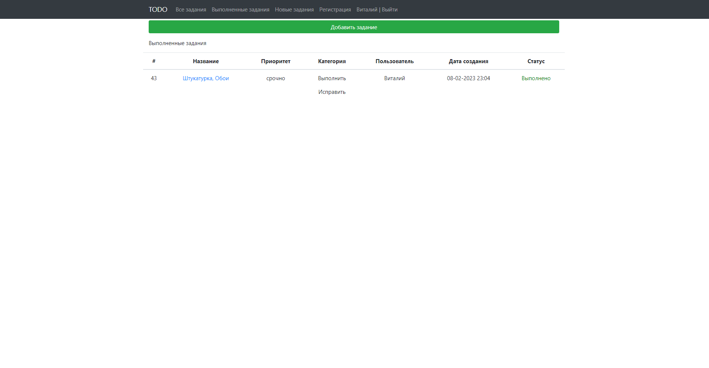

# TODO

# Описание проекта
Проект приложения хранилища заданий.
Виды:
- Страница со списком всех заданий. В таблице отображаем имя, дату создания и состояние (выполнено или нет)
Есть кнопка "Добавить задание". Три ссылки: Все, Выполненные, Новые. 
- Все задания - отображаются все задания.
- Только выполненые задания - отображаются только выполненые задания.
- Новые задания - отображаются новые задания.
- Страница задания - при клике на задание переходим на страницу с подробным описанием. 
На странице с подробным описанием есть кнопки: Выполнено, Отредактировать, Удалить.
Если нажали на кнокпу выполнить, то задание переводиться в состояние выполнено.
Кнопка редактировать переводит пользователя на отдельную страницу для редактирования.
Кнопка удалить, удаляет задание и переходит на список всех заданий
- Страница редактирования задания - поля редактирования задания. кнопка сохранить / отменить.

# Стек технологий
- Java 17
- SpringBoot 2.7.4
- Thymeleaf 2.7.4
- Bootstrap 4.4.1
- PostgreSQL 14
- Junit 5.8.2
- AssertJ 3.23.1
- Log4j 1.2.17
- Jcip annotations 1.0
- h2database 2.1.214
- Mockito 4.0.0
- Checkstyle-plugin 3.1.2
- Liquibase 4.15.0
- Lombok 1.18.22
- Hibernate 5.6.11

# Требования к окружению
- Java 17
- Maven 3.8
- PostgreSQL 14
- 
# # Взаимодействие с приложением
#### Страница со всеми заданиями

#### Страница с выполненными заданиями

#### Страница с актуальными заданиями

#### Страница с просмотром задания

#### Страница редактирования задания

#### Страница успешного редактирования задания

#### Страница ошибки при редактировании задания

#### Страница успешного удаления задания
